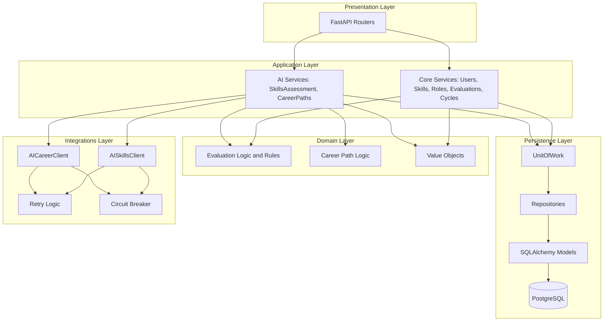

# ARCHITECTURE.md — career-paths-api

## Diagrama



## 1. Propósito del sistema

`career-paths-api` es una API backend en **Python + FastAPI** para gestionar:

1. Evaluación 360°
2. Skills Assessment con IA
3. Generación de Senderos de Carrera con IA
4. Consulta y aceptación de rutas de desarrollo
5. Matriz de competencias por puesto
6. Agregación inteligente de evaluaciones y gap analysis
7. Infraestructura preparada para múltiples organizaciones y escalabilidad

El sistema debe ser:

- Escalable (objetivo: soportar miles de usuarios concurrentes).
- Resiliente frente a fallos del servicio de IA.
- Observables (métricas, logs, health checks).
- Fácil de extender (nuevos endpoints, nuevos proveedores de IA).


Este documento sirve como:

- Guía arquitectónica completa  
- Manual operativo para Copilot
- Referencia para implementar modelos, repositorios, servicios y endpoints  
- Base para entregar un MVP  

---

## 2. Requerimientos funcionales

El sistema debe permitir:

### Evaluación 360°

- Crear evaluaciones individuales (self, peers, manager, direct reports)
- Registrar competencias evaluadas y comentarios
- Determinar cuándo un ciclo está completo
- Consolidar resultados por competencia

### Skills Assessment con IA

- Enviar resultados agregados a un servicio IA
- Generar fortalezas, áreas de oportunidad, talentos ocultos
- Generar readiness por rol
- Guardar todo de forma estructurada (items de assessment)

### Senderos de carrera

- Generar rutas personalizadas por la IA
- Incluir pasos, roles objetivo y acciones de desarrollo
- Registrar senderos recomendados o alternativos
- Aceptación del usuario

### Consultas

- Obtener evaluaciones
- Obtener skills assessments
- Obtener senderos
- Obtener pasos y acciones asociadas

---

## 3. Alcance funcional

### Endpoints Implementados (v1)

#### 🏥 Health & Monitoring

- `GET /health` — Health check simple (siempre 200 OK)
- `GET /ready` — Readiness check (valida conectividad con PostgreSQL)

#### Evaluation Cycles (Gestión de Ciclos)

- `POST /api/v1/evaluation-cycles` — Crear ciclo de evaluación
- `GET /api/v1/evaluation-cycles/{cycle_id}` — Obtener ciclo específico
- `GET /api/v1/evaluation-cycles` — Listar ciclos (filtros: status, paginación)
- `PATCH /api/v1/evaluation-cycles/{cycle_id}` — Actualizar ciclo
- `DELETE /api/v1/evaluation-cycles/{cycle_id}` — Eliminar ciclo (solo si no tiene evaluaciones)

#### Evaluations (Evaluaciones 360°)

- `POST /api/v1/evaluations` — Crear evaluación 360°
- `GET /api/v1/evaluations/{evaluation_id}` — Obtener evaluación específica (con scores)
- `GET /api/v1/evaluations` — Listar evaluaciones (filtros: user_id, cycle_id, status)
- `POST /api/v1/evaluations/{evaluation_id}/process` — Procesar evaluación y agregar scores (202 Accepted)
- `GET /api/v1/evaluations/user/{user_id}/cycle/{cycle_id}/profile` — Obtener perfil de competencias agregado

#### Skills Assessments

- `POST /api/v1/skills-assessments` — Generar skills assessment con IA
- `GET /api/v1/skills-assessments/{assessment_id}` — Obtener assessment específico (con items)
- `GET /api/v1/skills-assessments` — Listar assessments (filtros: user_id, cycle_id, status)

#### Career Paths

- `POST /api/v1/career-paths` — Generar sendero de carrera con IA
- `GET /api/v1/career-paths/{path_id}` — Obtener sendero específico (con pasos y acciones)
- `GET /api/v1/career-paths` — Listar senderos (filtros: user_id, status, accepted)
- `POST /api/v1/career-paths/{path_id}/accept` — Aceptar sendero recomendado

#### Users (Gestión de Usuarios)

- `POST /api/v1/users` — Crear usuario
- `GET /api/v1/users/{user_id}` — Obtener usuario específico
- `GET /api/v1/users` — Listar usuarios (filtros: active_only, role_id, manager_id, paginación)
- `PATCH /api/v1/users/{user_id}` — Actualizar usuario
- `DELETE /api/v1/users/{user_id}` — Desactivar usuario (soft delete)

#### Skills

- `POST /api/v1/skills` — Crear competencia
- `GET /api/v1/skills/{skill_id}` — Obtener competencia específica
- `GET /api/v1/skills` — Listar competencias (filtros: active_only, category, global_only, paginación)
- `PATCH /api/v1/skills/{skill_id}` — Actualizar competencia
- `DELETE /api/v1/skills/{skill_id}` — Desactivar competencia (soft delete)

#### Roles o puestos

- `POST /api/v1/roles` — Crear rol
- `GET /api/v1/roles/{role_id}` — Obtener rol específico
- `GET /api/v1/roles` — Listar roles (filtros: active_only, job_family, paginación)
- `PATCH /api/v1/roles/{role_id}` — Actualizar rol
- `DELETE /api/v1/roles/{role_id}` — Desactivar rol (soft delete)

**Total de endpoints:** 36 endpoints activos

### Casos límite considerados

- Usuario con 0 evaluaciones completadas.
- Evaluaciones incompletas (faltan evaluadores).
- Servicio de IA caído, con respuestas parciales o errores.
- Timeouts y fallos en llamadas a servicios externos.
- Datos inconsistentes o corruptos en la BD.

---

## 3. Stack tecnológico

### Backend

- Python 3.12+
- FastAPI
- Pydantic v2 (schemas / DTOs)
- SQLAlchemy 2.0+ (modo async)
- PostgreSQL 15+ (via Docker)
- httpx (HTTP client async para IA y otros servicios)
- pytest + pytest-asyncio (tests)

### Infraestructura / Dev

- Docker + docker-compose
- Alembic (migraciones de BD)
- pydantic-settings (configuración via environment variables)
- Logging estructurado
- (Opcional) `just` justifle para comandos de desarrollo

---

## 4. Visión general de la arquitectura

Arquitectura por capas:

- **Presentation / API Layer**
  - FastAPI `main.py`
  - Routers v1:
    - `health.py` — Health checks
    - `evaluation_cycles.py` — Gestión de ciclos
    - `evaluations.py` — Evaluaciones 360°
    - `skills_assessments.py` — Skills assessments con IA
    - `career_paths.py` — Senderos de carrera con IA
    - `users.py` — Gestión de usuarios
    - `skills.py` — Gestión de competencias
    - `roles.py` — Gestión de roles
  - Schemas Pydantic v2 (entradas/salidas)
  - Middlewares (request-id, rate limit, metrics)

- **Application / Services Layer**
  - Servicios de aplicación:
    - `EvaluationService` — Evaluaciones 360°
    - `EvaluationCycleService` — Gestión de ciclos
    - `SkillsAssessmentService` — Generación de assessments con IA
    - `CareerPathService` — Generación de senderos con IA
    - `UserService` — Gestión de usuarios
    - `SkillService` — Gestión de competencias
    - `RoleService` — Gestión de roles
  - Orquestan lógica de negocio, repositorios y clientes IA.
  - Usan Unit of Work para operaciones atómicas en la BD.

- **Domain Layer (opcional)**
  - Reglas puras de negocio, sin dependencias de framework:
    - Estados de una evaluación (PENDING, IN_PROGRESS, COMPLETED, EXPIRED).
    - Cálculo de porcentaje completado.
    - Gap analysis (skill actual vs requerido)
    - Transformación de resultados a un modelo de carrera.

- **Persistence Layer**
  - SQLAlchemy async + PostgreSQL
  - Modelos de BD en `db/models`
  - Repositorios por agregado
  - UnitOfWork para transacciones

- **External Integrations Layer**
  - Clientes IA:
  - `ai_skills_client.py`
  - `ai_career_client.py`
  - httpx + retry/backoff + circuit breaker
  - Manejo de timeouts y errores robusto

- **Cross-cutting / Infra**
  - Configuración (pydantic-settings).
  - Logging estructurado.
  - Manejo centralizado de errores.
  - Seguridad (futuro: JWT, scopes).
  - Utilidades (ids, fechas, formateo)

---

## 5. Estructura de carpetas

Estructura de proyecto propuesta:

```text
career-paths-api/
├─ app/
│  ├─ __init__.py
│  ├─ main.py                      # Creación de la app FastAPI y registro de routers/middleware
│  │
│  ├─ core/                        # Infraestructura cross-cutting
│  │  ├─ __init__.py
│  │  ├─ config.py                 # pydantic-settings (env vars)
│  │  ├─ logging.py                # Config de logging estructurado
│  │  ├─ errors.py                 # Excepciones base y códigos de error
│  │  └─ error_constants.py        # Constantes de error centralizadas
│  │
│  ├─ middleware/                  # Middlewares globales
│  │
│  ├─ api/
│  │  ├─ __init__.py
│  │  └─ v1/                       # Routers
│  │     ├─ __init__.py
│  │     ├─ health.py              # /health, /ready
│  │     ├─ evaluation_cycles.py   # /api/v1/evaluation-cycles
│  │     ├─ evaluations.py         # /api/v1/evaluations
│  │     ├─ skills_assessments.py  # /api/v1/skills-assessments
│  │     ├─ career_paths.py        # /api/v1/career-paths
│  │     ├─ users.py               # /api/v1/users
│  │     ├─ skills.py              # /api/v1/skills
│  │     └─ roles.py               # /api/v1/roles
│  │
│  ├─ schemas/                     # Pydantic v2: DTOs entrada/salida
│  │  ├─ __init__.py
│  │  ├─ core/                     # Schemas de entidades core
│  │  │  ├─ user.py
│  │  │  ├─ skill.py
│  │  │  └─ role.py
│  │  ├─ evaluation/               # Schemas de evaluaciones
│  │  │  ├─ evaluation.py
│  │  │  ├─ evaluation_cycle.py
│  │  │  └─ competency.py
│  │  ├─ skills_assessment/        # Schemas de skills assessments
│  │  │  └─ skills_assessment.py
│  │  ├─ career_path/              # Schemas de career paths
│  │  │  └─ career_path.py
│  │  └─ mappers/                  # Mappers entre modelos y schemas
│  │     └─ evaluation_mapper.py
│  │
│  ├─ db/                          # Capa de persistencia
│  │  ├─ __init__.py
│  │  ├─ base.py                   # Declarative Base
│  │  ├─ session.py                # Engine async + AsyncSessionLocal
│  │  ├─ models/                   # Tablas (SQLAlchemy) organizadas por dominio
│  │  │  ├─ __init__.py
│  │  │  ├─ core/                  # Entidades core
│  │  │  │  ├─ user.py
│  │  │  │  ├─ skill.py
│  │  │  │  └─ role.py
│  │  │  ├─ evaluation/            # Evaluaciones
│  │  │  │  ├─ evaluation.py
│  │  │  │  ├─ evaluation_cycle.py
│  │  │  │  └─ competency_score.py
│  │  │  ├─ skills_assessment/     # Skills assessments
│  │  │  │  ├─ skills_assessment.py
│  │  │  │  └─ assessment_item.py
│  │  │  ├─ career_path/           # Career paths
│  │  │  │  ├─ career_path.py
│  │  │  │  ├─ career_path_step.py
│  │  │  │  └─ development_action.py
│  │  │  └─ infrastructure/        # Tablas de infraestructura
│  │  │     ├─ user_skill_score.py
│  │  │     └─ role_skill_requirement.py
│  │  ├─ repositories/             # Acceso a datos por agregado
│  │  │  ├─ __init__.py
│  │  │  ├─ core/                  # Repositorios core
│  │  │  │  ├─ user_repository.py
│  │  │  │  ├─ skill_repository.py
│  │  │  │  └─ role_repository.py
│  │  │  ├─ evaluation/            # Repositorios de evaluaciones
│  │  │  │  └─ evaluation_repository.py
│  │  │  ├─ skills_assessment/     # Repositorios de assessments
│  │  │  │  └─ skills_assessment_repository.py
│  │  │  └─ career_path/           # Repositorios de career paths
│  │  │     └─ career_path_repository.py
│  │  └─ unit_of_work.py           # UnitOfWork para transacciones atómicas
│  │
│  ├─ domain/                      # Lógica de dominio pura
│  │  ├─ __init__.py
│  │  ├─ evaluation_logic.py       # Reglas de ciclo, agregación, etc.
│  │  ├─ entities/                 # Domain entities
│  │  │  └─ competency.py
│  │  └─ types/                    # Value objects y tipos custom
│  │     └─ evaluation_types.py
│  │
│  ├─ services/                    # Application layer (casos de uso)
│  │  ├─ __init__.py
│  │  ├─ evaluation_service.py         # Crear/consultar/procesar evaluaciones
│  │  ├─ evaluation_cycle_service.py   # Gestión de ciclos
│  │  ├─ skills_assessment_service.py  # Generación de assessments con IA
│  │  ├─ career_path_service.py        # Generación de senderos con IA
│  │  ├─ user_service.py               # Gestión de usuarios
│  │  ├─ skill_service.py              # Gestión de competencias
│  │  ├─ role_service.py               # Gestión de roles
│  │  └─ dependencies.py               # Factories para DI (get_*_service)
│  │
│  ├─ integrations/                # Servicios externos (IA, HTTP)
│  │  ├─ __init__.py
│  │  ├─ http_client.py            # Wrapper genérico httpx
│  │  ├─ base_ai_client.py         # Cliente base para IA
│  │  ├─ ai_skills_client.py       # Cliente Skills Assessment AI
│  │  ├─ ai_career_client.py       # Cliente Career Path AI
│  │  ├─ retry.py                  # Retry con backoff (decorador)
│  │  └─ circuit_breaker.py        # Circuit breaker pattern (decorador)
│  │
│  ├─ utils/                       # Utilidades varias
│  │  ├─ __init__.py
│  │  ├─ ids.py                    # Helpers para IDs/UUID (vacío por ahora)
│  │  └─ time.py                   # Helpers de tiempo/fechas (vacío por ahora)
│  │
│  └─ __init__.py
│
├─ tests/                          # Pruebas
│  ├─ __init__.py
│  ├─ conftest.py                  # Fixtures compartidos (db_session, async_client, mocks)
│  ├─ README.md                    # Guía de testing
│  ├─ unit/                        # Tests unitarios (70% coverage target)
│  │  ├─ domain/                   # Tests de lógica de dominio pura
│  │  ├─ services/                 # Tests de servicios (con mocks)
│  │  └─ integrations/             # Tests de clientes externos
│  ├─ integration/                 # Tests de integración (25% coverage)
│  │  └─ api/                      # Tests de endpoints (full stack)
│  ├─ e2e/                         # Tests end-to-end (workflows completos)
│  │  ├─ test_evaluation_pipeline.py  # E2E service-level
│  │  └─ test_api_workflow.py         # E2E HTTP-level
│  ├─ factories/                   # Factories para crear datos de test
│  │  ├─ users.py
│  │  ├─ skills.py
│  │  ├─ evaluation_cycles.py
│  │  └─ evaluation.py
│  └─ helpers/                     # Helpers de testing
│     ├─ async_mocks.py
│     ├─ evaluations.py
│     └─ uow_mocks.py
│
├─ alembic/                        # Migraciones de BD
│
├─ scripts/                        # Scripts de desarrollo y mantenimiento
│
├─ docs/                           # Documentación
│  ├─ ARCHITECTURE.md              # Este documento
│  ├─ schema.md                    # Diseño de base de datos
│  ├─ flows.md                     # Flujos de negocio
│
├─ .github/
│  └─ workflows/
│     └─ test.yml                  # GitHub Actions CI/CD
│
├─ Dockerfile                      # Imagen de la app
├─ docker-compose.yml              # App + PostgreSQL (development)
├─ docker-compose.test.yml         # Testing con PostgreSQL aislado
├─ pyproject.toml                  # Dependencias y configuración del proyecto
├─ pytest.ini                      # Configuración de pytest
├─ alembic.ini                     # Configuración de Alembic
├─ .env.example                    # Ejemplo de variables de entorno
├─ README.md                       # Guía de inicio rápido
└─ Linea-pensamiento.md            # Requerimientos originales (español)                    
```

## 6. Decisiones Arquitectónicas Clave

### 6.1 Estilo arquitectónico y capas

La API sigue una **Clean Architecture orientada a dominios**, separando claramente:

- **API / Presentation Layer:** Routers FastAPI + schemas Pydantic.
- **Application / Service Layer:** servicios que orquestan casos de uso, transacciones y llamadas a IA.
- **Domain Layer:** lógica de negocio pura (reglas de evaluación, estados, agregación, gap analysis).
- **Persistence Layer:** modelos SQLAlchemy + repositorios + Unit of Work.
- **Integrations Layer:** clientes HTTP para servicios de IA con retry y circuit breaker.

Cada capa tiene una responsabilidad concreta, es testeable de forma aislada, y puede evolucionar sin tomar dependencias fuertes del framework o la base de datos.

---

### 6.2 Acceso a datos y consistencia

#### Unit of Work

Se implementa un **Unit of Work (UoW)** para agrupar operaciones de BD en una única transacción:

- Los servicios nunca manejan la sesión de BD directamente; solo interactúan vía UoW.
- El UoW expone repositorios (`users`, `evaluations`, `skills`, etc.) y gestiona `commit`/`rollback`.
- Garantiza que operaciones multi-repositorio sean **atómicas**: o se aplican todas, o ninguna.

**Razones principales:**

- Coherencia de datos en flows complejos.
- Mocking más simple en testing.
- Evita sesiones globales o mal gestionadas.

**Implementación típica de UoW:**

```python
class UnitOfWork:
    def __init__(self, session: AsyncSession):
        self.session = session
        # Lazy initialization de repositorios
        self._users: Optional[UserRepository] = None
        self._evaluations: Optional[EvaluationRepository] = None
        # ... otros repositorios
    
    @property
    def users(self) -> UserRepository:
        if self._users is None:
            self._users = UserRepository(self.session)
        return self._users
    
    async def commit(self):
        await self.session.commit()
    
    async def rollback(self):
        await self.session.rollback()
```

#### Repository Pattern

Cada agregado de dominio tiene su repositorio correspondiente:

- Encapsulan consultas SQLAlchemy.
- Proveen métodos de alto nivel (`get_by_email`, `list_by_cycle`, etc.).
- La capa de servicios no escribe SQL ni manipula modelos directamente.

**Beneficios:**

- Separación clara de responsabilidades.
- Queries reutilizables.
- Posibilidad de intercambiar detalles de persistencia sin tocar capas superiores.
**Implementación típica:**

```python
class UserRepository:
    def __init__(self, session: AsyncSession):
        self.session = session
    
    async def get_by_id(self, user_id: UUID) -> Optional[User]:
        stmt = select(User).where(User.id == user_id)
        result = await self.session.execute(stmt)
        return result.scalar_one_or_none()
    
    async def get_by_email(self, email: str) -> Optional[User]:
        stmt = select(User).where(User.email == email)
        result = await self.session.execute(stmt)
        return result.scalar_one_or_none()
    
    async def create(self, data: UserCreate) -> User:
        user = User(**data.model_dump())
        self.session.add(user)
        await self.session.flush()  # Get ID without committing for UoW
        return user
```

### Inyección de dependencias (FastAPI DI)

La API usa el sistema de Dependency Injection de FastAPI para conectar:
  
- Sesiones de base de datos → UnitOfWork → Servicios de aplicación → Routers.
Esto permite:
- Un contexto por request (cada petición tiene su propia sesión/UoW).
- Sustituir dependencias fácilmente en tests (mocks de UoW o servicios).
- Evitar singletons globales y acoplamientos fuertes.

**Implementación:**

```python
# Dependency factory para DB session
async def get_db_session() -> AsyncGenerator[AsyncSession, None]:
    async with AsyncSessionLocal() as session:
        yield session

# Dependency factory para UnitOfWork
async def get_uow(
    session: AsyncSession = Depends(get_db_session)
) -> AsyncGenerator[UnitOfWork, None]:
    uow = UnitOfWork(session)
    try:
        yield uow
    finally:
        await session.close()

# Dependency factory para servicios
def get_evaluation_service(
    uow: UnitOfWork = Depends(get_uow)
) -> EvaluationService:
    return EvaluationService(uow)
```

**Uso en routers:**

```python
@router.post("/evaluations")
async def create_evaluation(
    data: EvaluationCreate,
    service: EvaluationService = Depends(get_evaluation_service)
):
    return await service.create_evaluation(data)
```

#### SQLAlchemy Async + PostgreSQL

- SQLAlchemy 2.0 async se alinea con FastAPI en no bloquear el event loop.
- Se usa la sintaxis moderna con `Mapped[...]` + `mapped_column` para tipado y DX.
- `expire_on_commit=False` permite devolver entidades después del commit sin problemas de expiración.

#### UUIDs y Soft Delete

- Todas las entidades clave usan **UUID** como primary key:
  - Menos predecibles.
  - Aptos para entornos distribuidos.
- Algunas entidades implementan **soft delete** (`is_active`, `deactivated_at`):
  - Preserva historial.
  - Mantiene integridad referencial.
  - Permite restaurar entidades si fuera necesario.

---

### 6.3 Resiliencia frente a servicios externos (IA)

La API considera los servicios de IA como sistemas externos propensos a fallas. Por ello implementa:

#### Retry con Backoff Exponencial

- Decorador `with_retry`.
- Reintentos configurables: número de intentos, delay inicial, crecimiento exponencial.
- Evita duplicar lógica de reintentos en cada llamada a IA.

#### Circuit Breaker

- Decorador `with_circuit_breaker`.
- Estados: `CLOSED` → `OPEN` → `HALF_OPEN`.
- Si la IA falla repetidamente, el sistema deja de llamarla por un periodo, evitando sobrecarga y permitiendo recuperación.

#### Logging de Llamadas a IA

La tabla `ai_calls_log` registra:

- Payload enviado.
- Payload recibido.
- Latencia.
- Estado de cada llamada.

Provee:

- Auditoría completa.
- Observabilidad del comportamiento de la IA.
- Métricas para detectar degradación o fallas.

---

### 6.4 Validación, contratos de API y manejo de errores

#### Pydantic v2 como DTOs

Los schemas Pydantic v2 cumplen tres roles:

1. Validación de entrada (`*Create`, `*Update`).
2. Serialización de salida (`*Response`).
3. Contrato formal del API (documentación + tipado).

Se usa `from_attributes=True` para mapear directamente desde modelos SQLAlchemy a schemas Pydantic.

#### Manejo Centralizado de Errores

- Excepciones personalizadas (`NotFoundError`, `ValidationError`, `ConflictError`, etc.).
- Handler global convierte excepciones en JSON estructurado:
  - `error`, `message`, `details`.

Mensajes y códigos se centralizan en `error_constants.py` para uniformidad e internacionalización futura.

---

### 6.5 Estrategia de Testing

Testing estructurado en pirámide:

#### Unit Tests

- Prueban lógica pura: dominio + servicios.
- UoW, repositorios y clientes externos mockeados.
- Rápidos y de bajo costo de ejecución.

#### Integration Tests

- Usan una base de datos real PostgreSQL de test.
- Validan interacción completa entre API + ORM + BD.
- Los clientes de IA siguen mockeados.

#### End-to-End (E2E)

- Prueban flujos de negocio completos vía HTTP.
- Simulan uso real desde el frontend: creación de usuarios, evaluaciones, generación IA, etc.

Se usan **factories** para generar datos de test consistentes y evitar repetición.

---

### 6.6 Configuración, logging y decisiones específicas

#### Configuración Centralizada

- pydantic-settings define variables de entorno tipadas.
- Singleton vía `get_settings()` cacheado.
- Fácil despliegue en múltiples ambientes (dev, test, prod).

#### Logging Estructurado

- Formato consistente de logs.
- Contexto adicional por operación (IDs, ciclos, evaluadores).
- Claridad en el análisis de errores e investigación en producción.

#### Decisiones puntuales


#### Normalización `competency_name → skill_id`

El frontend trabaja con nombres de competencias y el backend los resuelve a IDs internos, validando su existencia y evitando exponer UUIDs innecesarios.

#### Uso de `flush()` antes de `commit()`

Permite obtener IDs generados dentro de la misma transacción sin comprometer la atomicidad.

#### JSONB para estadísticas de skills

El campo `raw_stats` captura distribuciones, promedios y datos auxiliares sin rigidizar el esquema.  
Facilita consultas dinámicas y reduce migraciones.

---

Con estas decisiones, la API se mantiene alineada con prácticas modernas para servicios que integran **IA como componente central**.
